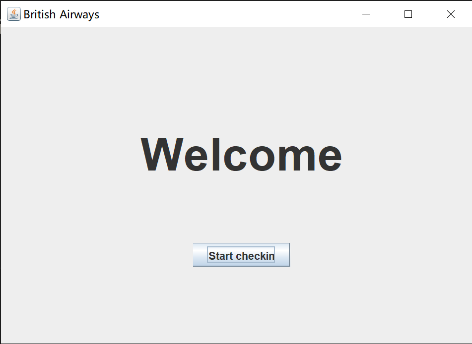
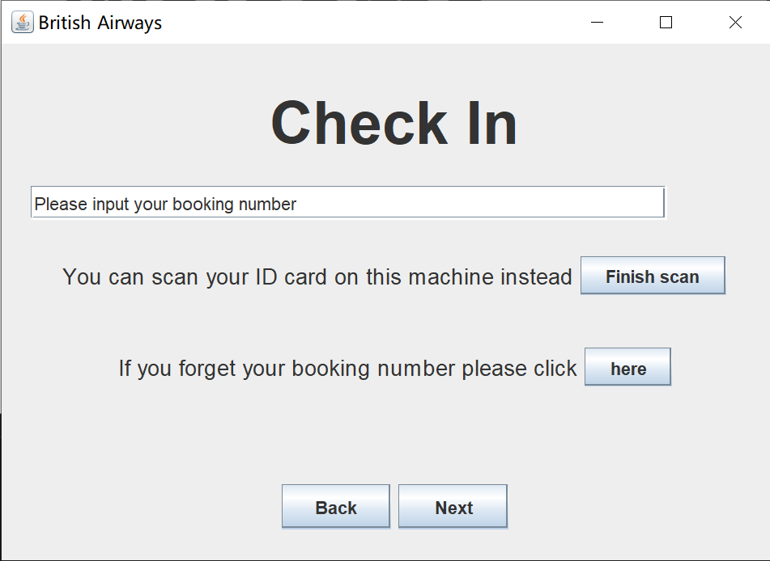
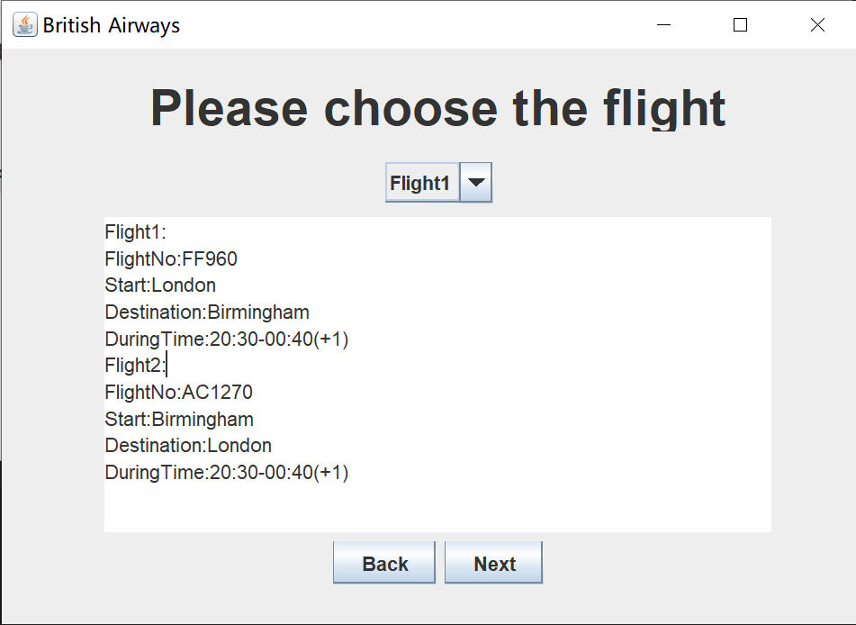
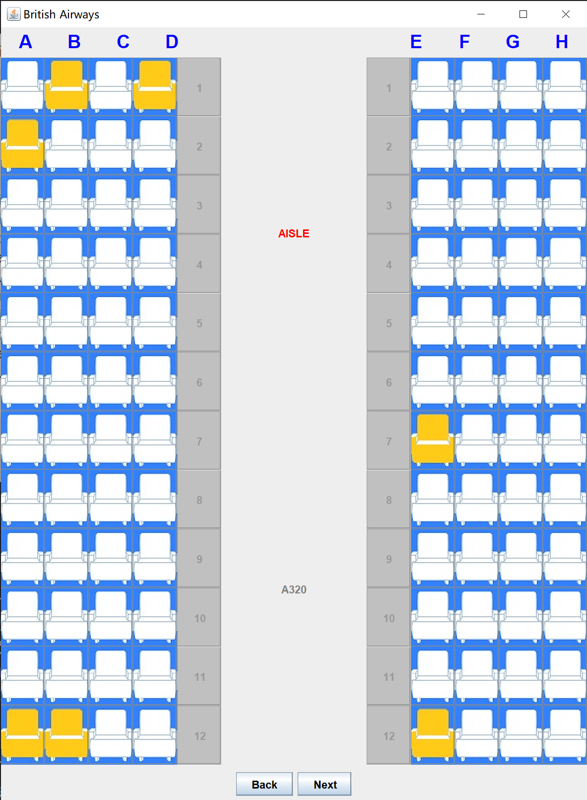
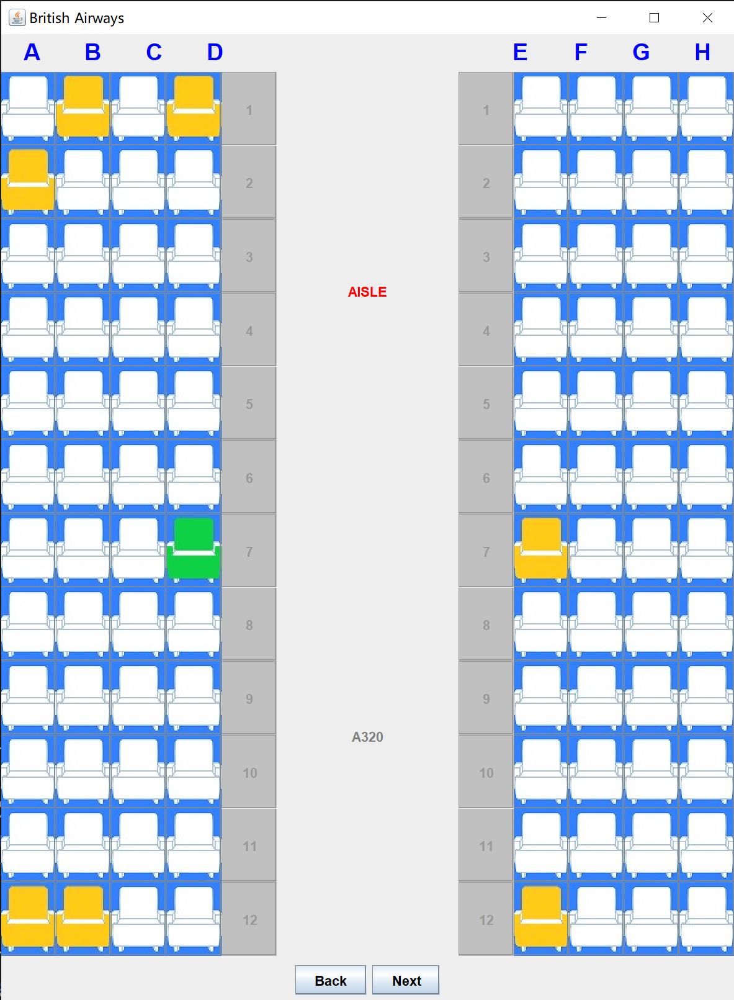
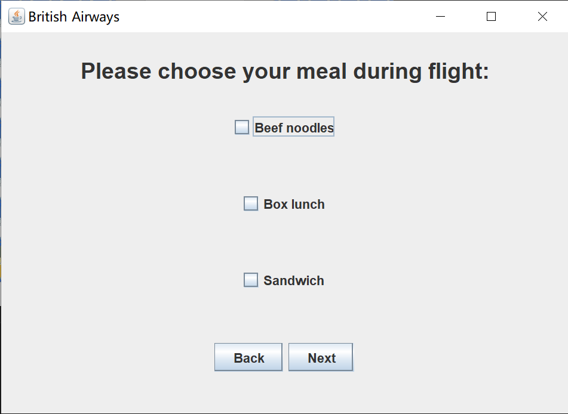
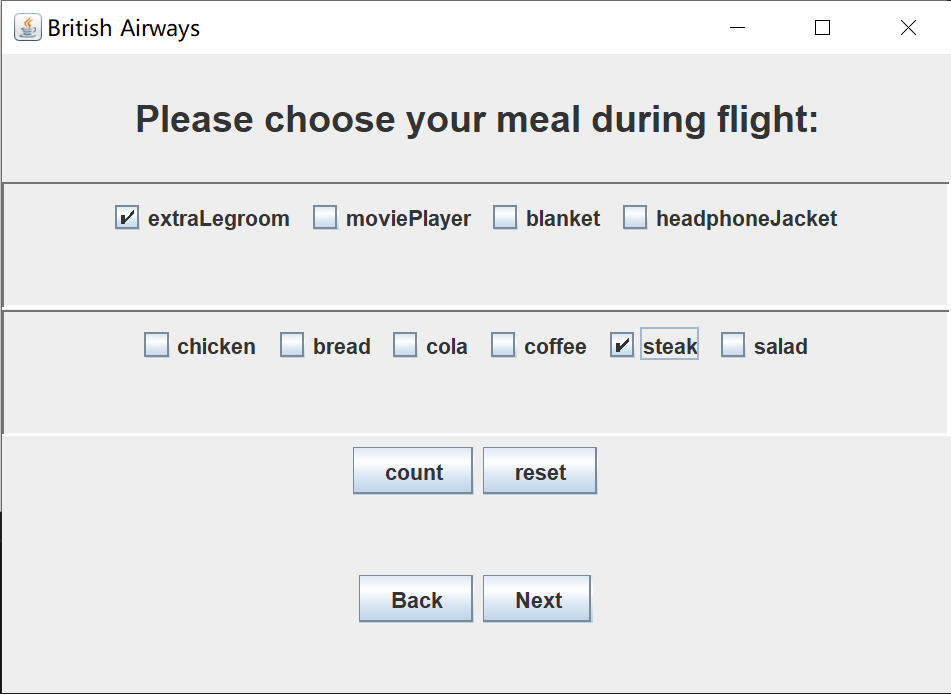
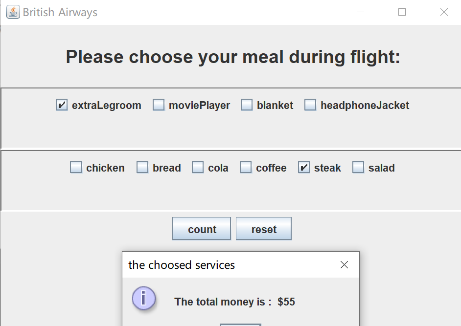
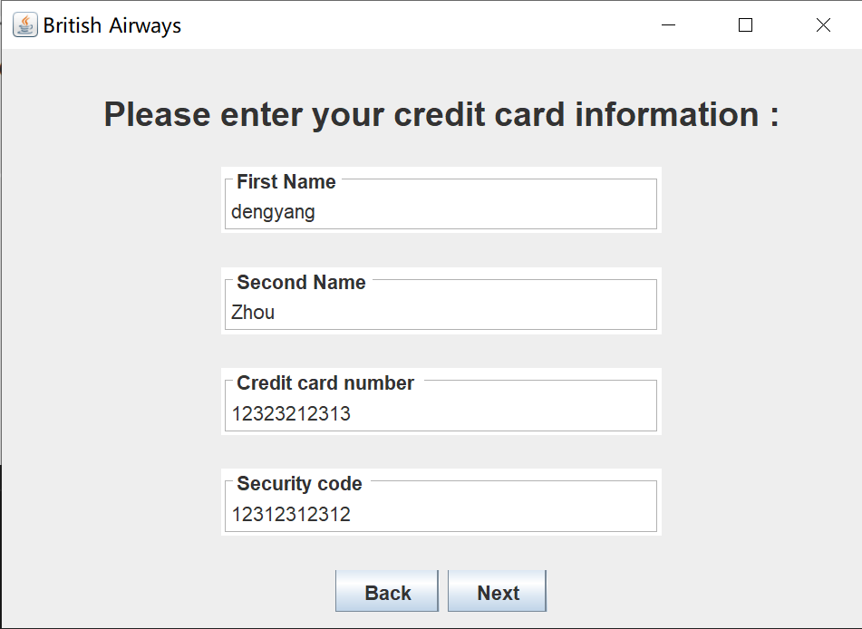
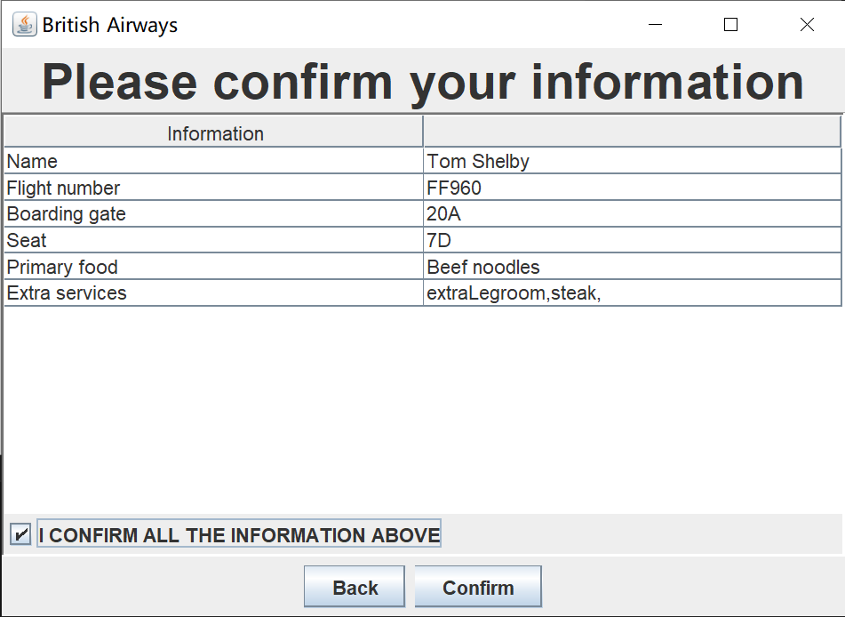

# SoftwareEngineer_Airline

This is the repository of the 2022, BUPT, IOT, group 106.  
All Rights Reserved.

## Project Overview

This project is an airline management system designed to handle various aspects of airline operations, including flight management, passenger data, and check-in processes.

## Directory Structure

- **`src/`**: Core source code of the project.
- **`data/`**: Stores customer data, including:
  - `checkinData/`: Data related to check-in processes.
  - `flightData/`: Data related to flight schedules and details.
  - `passengerData/`: Data related to passenger information.
- **`lib/`**: Contains dependencies used in the project, such as `gson-2.8.4.jar`.
- **`develop log/`**: Development logs for different versions.
- **`javadoc/`**: Documentation for the codebase.
- **`pictures/`**: Images or other visual assets.
- **`.vscode/`**: Visual Studio Code settings for the project.
- **`.idea/`**: IntelliJ IDEA project configuration files.

## Prerequisites

- Java Development Kit (JDK) 8 or higher.
- A Java IDE such as IntelliJ IDEA or Visual Studio Code.
- Maven or Gradle for dependency management (if applicable).

## How to Build and Run

1. Clone the repository:
   ```bash
   git clone https://github.com/dengyang-zhou/SoftwareEngineer-Airline
   ```
2. Open the project in your preferred IDE.
3. Run the software106.jar file or execute the main class from the src/ directory.
   
## Features

1. ✈️ Enter booking information
2. 🔎 View and select flights
3. 💺 Choose seats (availability indicated)
4. 🍱 Select in-flight meals
5. ➕ Additional services (e.g., extra legroom, food & drinks)
6. 💳 Enter payment information
7. ✔️ Confirmation

### User Interface 

#### Welcome Page

The starting page of the system.
User can click “Start check-in” to proceed.



#### Booking Information

Passengers can enter their booking number, or choose to scan ID.
A help button is provided for forgotten booking numbers.



#### Flight Selection

A list of available flights is displayed with details including:

* Flight Number
* Departure & Destination
* Time Duration
* Users select which flight to check in.



#### Seat Selection

Passengers can select their preferred seat on an A320 layout.
The UI shows availability by color:

✅ Green — Selected

⚠️ Yellow — Occupied / unavailable

⬜ White — Available




#### Meal Selection (Simple)

Passengers may pick from simple in-flight meals such as:

* Beef noodles
* Box lunch
* Sandwich



#### Meal & Extra Services (Advanced Options)

Passengers may also choose from additional services such as:

* Extra legroom
* Blanket
* Movie player
* Headphone jacket

Food items include:

* Chicken
* Bread
* Cola
* Coffee
* Steak
* Salad

A count button calculates total cost, and reset clears all checks.



Example calculated total:



#### Credit Card Information

Passengers enter:
* First name
* Last name
* Credit card number
* Security code



#### Confirmation Page

The last is the confirmation page:


#### System Flow Summary

```bash
Welcome → Enter Booking Info → Select Flight → Seat Selection
→ Select Meal & Services → Payment → Confirmation
```

### Data Storage
The `data/` folder contains all the necessary data files for the application:

Passenger Data: Stored in `data/passengerData/`. Each passenger has a separate JSON file with details such as booking number, flight information, seat, and additional services. For example:

```java
{
  "BookingNo": 111111,
  "firstName": "Ming",
  "lastName": "Li",
  "idNo": "321321321",
  "flightNumber": "FF960",
  "boardingTime": "2022-4-17 20:00",
  "boardingGate": "20A",
  "startWhere": "London",
  "destWhere": "Birmingham",
  "duringTime": "20:30-00:40(+1)",
  "checkin": false,
  "seat": "12A",
  "primaryFood": "Box lunch",
  "extraService": "cola,"
}
```
* Flight Data: Stored in data/flightData/, containing flight schedules and details.
* Check-In Data: Stored in data/checkinData/, containing information about passengers who have completed the check-in process.

### Contributors
Group 106, BUPT, IOT, 2022.
